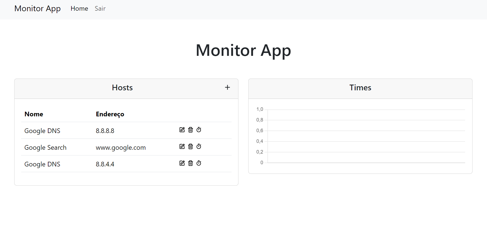

<h1 align="center"> Monitor App </h1>

O projeto Monitor App consiste em uma aplicação Web para monitorar a disponibilidade e latência de host cadastrados sistema.

  <a href="#tecnologias">Tecnologias</a>&nbsp;&nbsp;&nbsp;|&nbsp;&nbsp;&nbsp;
  <a href="#layout">Layout</a>

  

## Tecnologias

Esse projeto foi desenvolvido com as seguintes tecnologias:

- Front-end
  - [Vite](https://vitejs.dev/)
  - [Bootstrap](https://getbootstrap.com/)
  - [Chart.js](https://www.chartjs.org/)
- Back-end
  - [Express](https://expressjs.com/)

## Layout

As telas do projeto estão disponíveis [neste projeto](https://figma.com/file/3rWtag6oLh0amk2wS0XQH1/monitor-app) do Figma.
